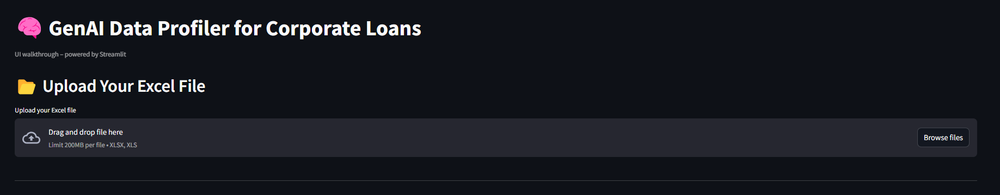

# 🚀 This project is a modular framework for profiling structured data using Streamlit, LangChain, and GPT.

# Team :  'Bit Wolves'

## 📌 Table of Contents
- [Introduction](#introduction)
- [Demo](#demo)
- [Inspiration](#inspiration)
- [What It Does](#what-it-does)
- [How We Built It](#how-we-built-it)
- [Challenges We Faced](#challenges-we-faced)
- [How to Run](#how-to-run)
- [Tech Stack](#tech-stack)
- [Team](#team)

---

## 🎯 Introduction
A brief overview of your project and its purpose. Mention which problem statement are your attempting to solve. Keep it concise and engaging.

## 🎥 Demo
check root folder

## 💡 Inspiration

Regulatory data submissions like the FR Y-14Q require banks to report hundreds of fields accurately and consistently. Manual validation of these fields is tedious, error-prone, and resource-intensive. We were inspired to build a smart assistant that could not only validate this data against complex rule sets, but also explain what's wrong and suggest fixes — just like a domain expert would.

Our goal:  
> Automate and explain the validation of complex loan data using GenAI — to reduce compliance risk and boost confidence in data quality.

---

## ⚙️ What It Does

This project is a **Streamlit-based UI** powered by **LangChain and OpenAI GPT**, that allows users to:

- 📂 Upload a corporate loan dataset (CSV or Excel)
- 🧪 Validate fields against 100+ FR Y-14Q rules (formats, codes, logic, etc.)
- 🤖 Get AI-generated explanations and remediation suggestions for flagged rows
- 📊 Automatically assign risk scores (Low / Medium / High)
- ✍️ Generate new validation rules using natural language prompts via GPT
- 📥 Download a validated dataset with issues highlighted

---

## 🛠️ How We Built It

- **Streamlit** for interactive UI
- **Pandas** for data handling
- **OpenAI API** (GPT-4) for rule generation and remediation
- **LangChain** for prompt chaining and LLM integration
- **Python** for all rule-based validation logic
- 🐺 Team: Bit Wolves

---

## 🚧 Challenges We Faced

- 📚 Interpreting FR Y-14Q MDRM documentation into clean, reusable validation rules
- ⚖️ Balancing performance and modularity — handling 100+ validations without slowing down
- 💬 Designing GPT prompts that return consistent, domain-appropriate suggestions
- 🧑Building an interface friendly enough for auditors and business users
- 🎥 Recording realistic-looking UI walkthroughs without a full backend pipeline
- 🔐 Managing OpenAI key usage and latency during rapid testing/demo cycles

---

## 🏃 How to Run
streamlit run "genai_data_profiling.py"

## 🏗️ Tech Stack
🖥️ Streamlit – for building the interactive frontend UI
📊 Pandas – to load, process, and manipulate Excel/CSV data
📁 openpyxl / XlsxWriter – for reading and writing Excel files
🤖 OpenAI GPT-4 API – to generate explanations, fixes, and new rules
🔗 LangChain – to structure and manage GPT prompt interactions
🛠️ Python – for custom rule-based validations (100+ field-level checks)
📉 Custom Risk Engine – to assign Low/Medium/High risk levels
🔐 dotenv – to manage API keys securely
📦 requirements.txt – for dependency management and easy setup

## 👥 Team: Bit Wolves
- **Balaji Rajan T S** - https://github.com/tsbr007 | https://www.linkedin.com/in/balaji-rajan/
- **Vijaykanth Veeraiyan** - https://www.linkedin.com/in/vijaykanth-veeraiyan/